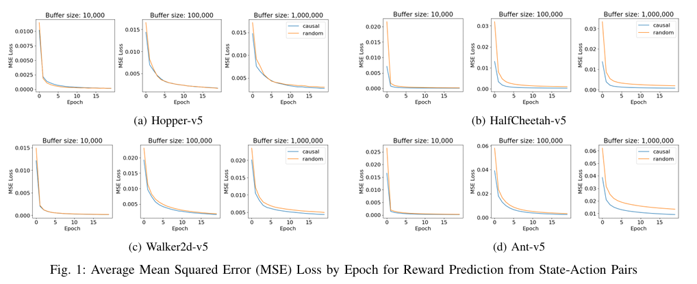

# Causal Explorer

Investigating the Use of Controlled Experiments in Simulation to Stabilize Off-Policy Reinforcement Learning

Research project for CS590 Robot Learning, Fall 2024

Chris Oswald

## Abstract

Model-free reinforcement learning (RL) algorithms provide a general framework to learn complex, continuous control tasks without requiring a model of the environment’s state transition dynamics. However, since these algorithms search for an optimal policy through trial-and-error, they tend to exhibit high variability across experiments. Researchers often need to spend a significant amount of time and effort tuning hyperparameters and running tens or hundreds of experiments to determine if an algorithm is effective for a particular task. We hypothesize that improving an agent’s understanding of the causal relationship between rewards and state-action pairs earlier in the training process will reduce variability across experiments, and we propose a method to leverage the controlled nature of simulation environments to generate off-policy training data that has a stronger causal signal between rewards and state-action pairs.

## Algorithm

## Results

